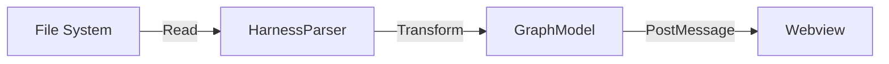

# Design: harness-parser (FEAT-002)

## Architecture
This feature focuses on the data transformation layer of the extension. It acts as a bridge between the raw file system (JSON/Markdown) and the Graph UI.

- **Data Model:** A unified `GraphData` interface containing:
  - `nodes`: Array of `{ id, type, label, metadata }`.
  - `edges`: Array of `{ id, source, target, label }`.
- **Parsing Strategy:**
  - **JSON:** Native `JSON.parse`.
  - **Markdown:** Use a lightweight frontmatter parser (like `gray-matter`) to extract YAML metadata.
- **Watching:** Use `vscode.workspace.createFileSystemWatcher` to detect changes and trigger re-parsing.

## Data Flow

## Discarded Alternatives
- **Alternative: Parsing only JSON and ignoring Markdown details.**
  - *Reason for discarding:* The missions and specific sub-agent tasks are only in the Markdown files. A true visualizer needs this depth.
- **Alternative: Using a full-blown AST parser for Markdown.**
  - *Reason for discarding:* Overkill for the current needs. Frontmatter + regex for sections is faster and sufficient for an MVP.

## Risks
- **Risk:** Performance issues when watching a large number of files.
  - *Mitigation:* Limit watchers to the `.agents/` directory and `feature_list.json`.

## External Dependencies
- `gray-matter` (for frontmatter parsing)
- `vscode`
