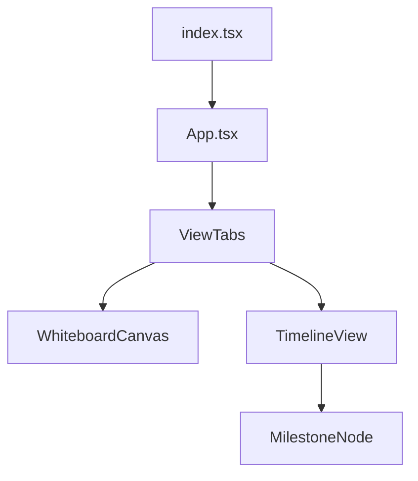

# Design: progress-timeline (FEAT-005)

## Architecture
This phase focuses on historical data visualization. It complements the Whiteboard by providing a temporal dimension.

- **Data Parsing:**
  - Enhance `HarnessParser` to read and regex-parse `progress/progress.md`.
  - Milestones will be extracted from headers like `## [YYYY-MM-DD] FEAT-XXX: <name>`.
- **UI Component:**
  - A new `TimelineView` component in the React Webview.
  - **Visualization Style:** A vertical line with "beads" representing features. Completed features are solid; pending features are hollow or dimmed.
- **Navigation:**
  - Use a tabbed interface or a toggle in the Webview to switch between the "Whiteboard" and "Timeline" views.

## Component Structure

## Discarded Alternatives
- **Alternative: Using a full Gantt chart library.**
  - *Reason for discarding:* Overkill for the current "git-commit" style vision. A simple custom vertical timeline is easier to style and fits the requested aesthetic better.
- **Alternative: Storing history in a separate JSON file.**
  - *Reason for discarding:* The Harness framework uses `progress.md` as the human-readable record. Maintaining two historical logs would lead to drift. Parsing the Markdown is the more "Harness-native" approach.

## Risks
- **Risk:** Variations in `progress.md` formatting by humans.
  - *Mitigation:* Use flexible regex and fall back gracefully to `feature_list.json` data if parsing fails.

## External Dependencies
- None (beyond existing React + UI Toolkit)
