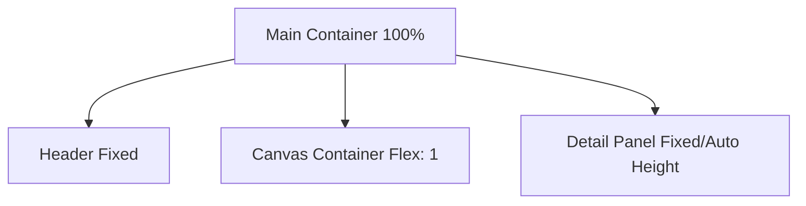

# Design: ui-ux-refinement (FEAT-006)

## Architecture
This phase refactors the layout management and data mapping to ensure a more robust and responsive UI.

- **Layout Fixes**:
  - Change `main` height to `100%`.
  - Use Flexbox `flex-grow: 1` for the `WhiteboardCanvas` container to fill available space.
  - Implement a `ResizeObserver` or use React Flow's built-in hooks to handle dynamic sizing.
- **Detail Panel**:
  - Use a resizable footer or a side-by-side layout (if width allows) for the Detail Panel.
  - For the VS Code sidebar (narrow width), a vertical stack with `overflow-y: hidden` on the main container and `overflow-y: auto` on specific panels is preferred.
- **Parser Robustness**:
  - Ensure the `primaryId` is correctly mapped even if the `default_agent` name doesn't match the folder name perfectly.
  - Validate that all nodes from `agentic.json` are added to the graph before Markdown parsing begins.

## Layout Diagram

## Discarded Alternatives
- **Alternative: Using a modal for details.**
  - *Reason for discarding:* Modals are intrusive for quick exploration of multiple nodes. A persistent detail panel allows for a better "browsing" experience.

## Risks
- **Risk**: Overlap between nodes if many skills are linked to one subagent.
  - *Mitigation*: Further increase `nodesep` in Dagre layout.

## External Dependencies
- None
