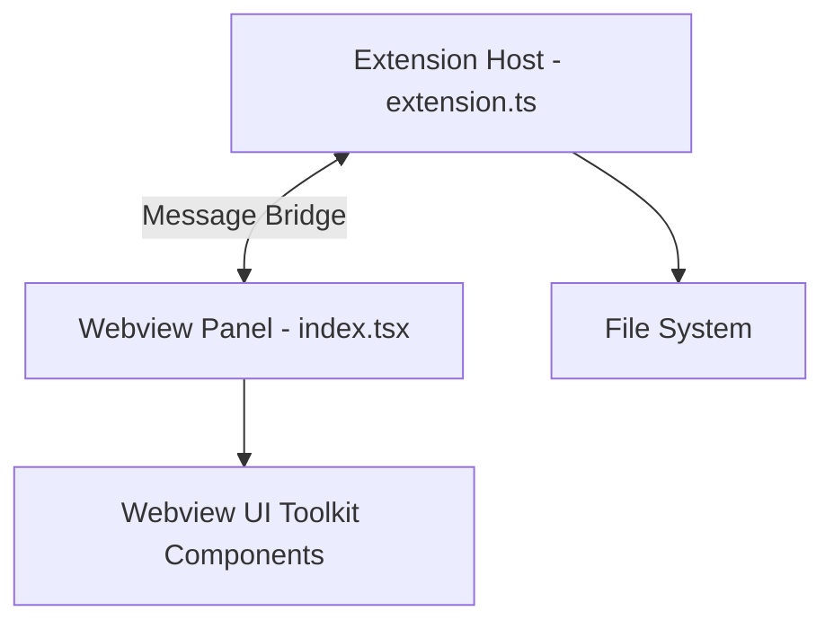

# Design: webview-foundation (FEAT-001)

## Architecture
The feature establishes a standard VS Code Webview architecture using React for the frontend and TypeScript for the backend (Extension Host).

- **Bundling:** A single `esbuild` script (`build.js`) will handle two entry points:
  1. `src/extension.ts` (Extension Host)
  2. `src/webview/index.tsx` (Webview React App)
- **Communication Bridge:** A `WebviewProvider` class in the Extension Host will manage the panel lifecycle and implement the `postMessage` / `onDidReceiveMessage` bridge.
- **UI Toolkit:** Integration of `@vscode/webview-ui-toolkit` via npm to provide native VS Code UI primitives.

## Component Diagram

## Discarded Alternatives
- **Alternative: Custom CSS instead of UI Toolkit.**
  - *Reason for discarding:* Harder to maintain theme consistency (light/dark/high-contrast) and accessibility. The `@vscode/webview-ui-toolkit` provides these for free.
- **Alternative: Webpack instead of esbuild.**
  - *Reason for discarding:* `esbuild` is significantly faster and is the recommended standard for modern extensions in 2026.

## Risks
- **Risk:** Complexity in managing `esbuild` for two distinct environments (Node.js for EH, Browser for Webview).
  - *Mitigation:* Use separate configuration objects within the same build script.

## External Dependencies
- `vscode` (Extension API)
- `react`, `react-dom`
- `@vscode/webview-ui-toolkit`
- `esbuild`
