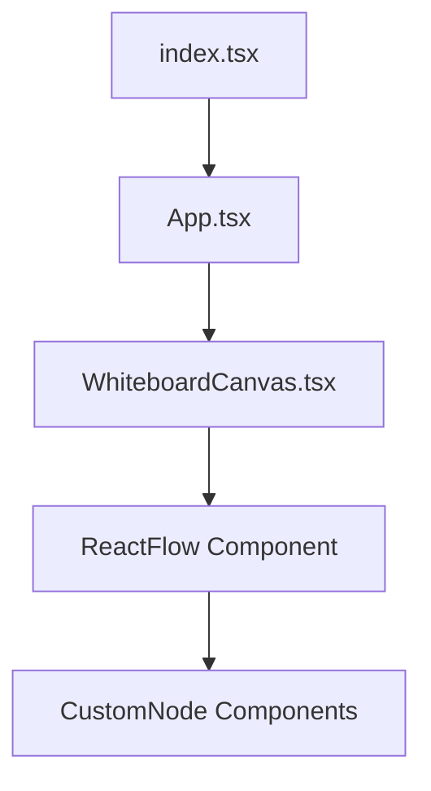

# Design: whiteboard-canvas (FEAT-003)

## Architecture
This phase focuses on the visualization layer. We use `reactflow` as the core engine for the infinite canvas.

- **Frontend Engine:** `reactflow` (standard for node-based UIs in React).
- **Custom Nodes:** We will implement custom React components for each `NodeType` (Agent, Subagent, Skill, Feature) to ensure they look native to VS Code.
- **Layout Engine:** `dagre` or a simple hierarchical layout logic to avoid overlapping nodes on initial load.
- **Theme Integration:** Use VS Code's CSS variables (`--vscode-*`) to ensure the canvas respects the active theme.

## Component Structure

## Discarded Alternatives
- **Alternative: Building a custom SVG canvas from scratch.**
  - *Reason for discarding:* `reactflow` handles zoom, pan, and complex node interactions efficiently. Developing this from scratch would delay the MVP.
- **Alternative: Using D3.js for force-directed layout.**
  - *Reason for discarding:* Force-directed layouts can be chaotic for hierarchical agent structures. A directed acyclic graph (DAG) layout is more appropriate for "Manager -> Sub-agent" relationships.

## Risks
- **Risk:** Bundle size increase due to `reactflow` and `dagre`.
  - *Mitigation:* Ensure `esbuild` is minifying correctly and only import necessary parts of the libraries.

## External Dependencies
- `reactflow`
- `dagre` (optional but recommended for layout)
