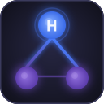

# Harness Dashboard

**Visual whiteboard for AI agent architectures** — map, trace and manage subagents, skills and relationships across any agentic framework.

---

## What it does

Harness Dashboard reads your workspace and renders an interactive graph of your AI agent setup:

- **Nodes** — Agents, Subagents, Skills and Features
- **Edges** — `manages`, `uses`, `suggested`, `discovered` relationships with semantic coloring
- **Semantic suggestions** — TF-IDF cosine similarity recommends missing skill connections
- **Detail panel** — click any node to read its description and Markdown file inline
- **Timeline** — SDD progress milestones in a git-style view

Works out of the box with **Harness SDD**, and ships with **universal adapters** for Claude Code, Gemini CLI, Cursor, GitHub Copilot and OpenCode (see the [Supported project structures](#supported-project-structures) table below).

---

## Features

| Feature | Description |
|---------|-------------|
| 🗺 **Whiteboard canvas** | Drag-and-drop, zoom, pan — powered by React Flow |
| 🔗 **Edge types** | `manages` (smoothstep), `uses` (dashed teal), `suggested` (animated amber), `discovered` (straight grey) |
| 💡 **Semantic skill discovery** | Suggests subagent↔skill connections from description text |
| 📋 **Inline Markdown viewer** | Read SUBAGENT.md / SKILL.md without leaving the panel |
| ✏️ **Edit in editor** | Open any Markdown file directly in the VS Code editor |
| 🔍 **Idoneity scoring** | Shows best semantic owner per skill, highlights mismatches |
| ⏸ **Toggle connections** | Disable/enable skill connections persistently |
| 🚫 **Dismiss suggestions** | Permanently hide unwanted suggestions (persisted across reloads) |
| 📅 **Progress timeline** | Visualize SDD feature lifecycle (pending → done) |

---

## Supported project structures

| Framework | Detection file | Status |
|-----------|---------------|--------|
| **Harness SDD** | `.agents/agentic.json` | first-class |
| **Claude Code** | `CLAUDE.md` / `.claude/agents/` | adapter (FEAT-015) |
| **Gemini CLI** | `GEMINI.md` | adapter (FEAT-015) |
| **Cursor** | `.cursor/rules/` | adapter (FEAT-015) |
| **GitHub Copilot** | `.github/copilot-instructions.md` | adapter (FEAT-015) |
| **OpenCode** | `opencode.json` | adapter (FEAT-015) |

> **Note on Windsurf:** the `WindsurfAdapter` source file still ships in the extension (the adapter was implemented in FEAT-015 before Windsurf was discontinued), but the table above does not advertise it because new users cannot realistically adopt a discontinued product. The adapter is retained for users with existing Windsurf workspaces. See `progress/decisions.md#adr-003-windsurf-discontinuation` for the rationale.

---

## Getting started

1. Install the extension
2. Open a workspace that uses [Harness SDD](https://github.com/marcmassa/harness-sdd-template.git) or any supported agentic framework  
3. Click the **Harness Dashboard** icon in the Activity Bar
4. The whiteboard renders your agent graph automatically

> **No config needed.** The extension detects your project structure on activation.

---

## Requirements

- VS Code 1.85 or newer
- A workspace with at least one supported agent config file (see table above)

---

## Extension settings

No settings required. State (dismissed suggestions, disabled connections) is persisted automatically per workspace via VS Code's `workspaceState`.

---

## Contributing

Issues and PRs welcome at [github.com/marcmassa/harness-manager](https://github.com/marcmassa/harness-manager).

---

## License

MIT © Marc Massa

---

## Note on the repository name

The **GitHub repository** is intentionally named `harness-manager`,
while the product, the VS Code extension, the npm package, the
VSIX file, and the VS Code Marketplace listing are all named
`harness-dashboard` (or `harness-dashboard-vscode` for the
package). The discrepancy is historical: the v0.1.0 release
of 2026-06-08 renamed the product from "Harness Manager" to
"Harness Dashboard" but the GitHub repository name was not
updated at that time.

This mismatch is **intentional and documented**. The decision
to keep the repository name as `harness-manager` (rather than
rename it to `harness-dashboard`) is recorded in
[`ADR-002`](./progress/decisions.md#adr-002-accept-the-github-repository-name-harness-manager-and-document-the-mismatch).
A future maintainer may choose to perform the rename at a
project milestone (e.g., v0.2.0 or v1.0.0); until then, the
two names refer to the same project.
