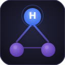

# Harness Dashboard

**Visual whiteboard for AI agent architectures** — map, trace and manage subagents, skills and relationships across any agentic framework.

---

## What it does

Harness Dashboard reads your workspace and renders an interactive graph of your AI agent setup:

- **Nodes** — Agents, Subagents, Skills and Features
- **Edges** — `manages`, `uses`, `suggested`, `discovered` relationships with semantic coloring
- **Semantic suggestions** — TF-IDF cosine similarity recommends missing skill connections
- **Detail panel** — click any node to read its description and Markdown file inline
- **Timeline** — SDD progress milestones in a git-style view

Works out of the box with **Harness SDD**, and FEAT-015 adds universal support for Claude Code, Gemini CLI, Cursor, GitHub Copilot, OpenCode and Windsurf (coming in next release).

---

## Features

| Feature | Description |
|---------|-------------|
| 🗺 **Whiteboard canvas** | Drag-and-drop, zoom, pan — powered by React Flow |
| 🔗 **Edge types** | `manages` (smoothstep), `uses` (dashed teal), `suggested` (animated amber), `discovered` (straight grey) |
| 💡 **Semantic skill discovery** | Suggests subagent↔skill connections from description text |
| 📋 **Inline Markdown viewer** | Read SUBAGENT.md / SKILL.md without leaving the panel |
| ✏️ **Edit in editor** | Open any Markdown file directly in the VS Code editor |
| 🔍 **Idoneity scoring** | Shows best semantic owner per skill, highlights mismatches |
| ⏸ **Toggle connections** | Disable/enable skill connections persistently |
| 🚫 **Dismiss suggestions** | Permanently hide unwanted suggestions (persisted across reloads) |
| 📅 **Progress timeline** | Visualize SDD feature lifecycle (pending → done) |

---

## Supported project structures

| Framework | Detection file |
|-----------|---------------|
| **Harness SDD** | `.agents/agentic.json` |
| Claude Code *(coming)* | `CLAUDE.md` / `.claude/agents/` |
| Gemini CLI *(coming)* | `GEMINI.md` |
| Cursor *(coming)* | `.cursor/rules/` |
| GitHub Copilot *(coming)* | `.github/copilot-instructions.md` |
| OpenCode *(coming)* | `opencode.json` |
| Windsurf *(coming)* | `.windsurf/rules/` |

---

## Getting started

1. Install the extension
2. Open a workspace that uses [Harness SDD](https://github.com/marcmassa/harness-manager) or any supported agentic framework  
3. Click the **Harness Dashboard** icon in the Activity Bar
4. The whiteboard renders your agent graph automatically

> **No config needed.** The extension detects your project structure on activation.

---

## Requirements

- VS Code 1.85 or newer
- A workspace with at least one supported agent config file (see table above)

---

## Extension settings

No settings required. State (dismissed suggestions, disabled connections) is persisted automatically per workspace via VS Code's `workspaceState`.

---

## Contributing

Issues and PRs welcome at [github.com/marcmassa/harness-manager](https://github.com/marcmassa/harness-manager).

---

## License

MIT © Marc Massa
