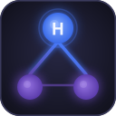

# Harness Dashboard

**Visual whiteboard for AI agent architectures** — map, trace and manage subagents, skills and relationships across any agentic framework.

[](https://github.com/marcmassa/harness-manager/actions/workflows/ci.yml)
[](https://github.com/marcmassa/harness-manager/releases)
[](https://code.visualstudio.com/updates/v1_85)



---

## Screenshots

| Whiteboard | SDD Panel |
|---|---|
|  |  |
| **Architecture Analysis & Advisory** | **Full-window Dashboard** |
|  |  |
| **Component Optimizer** *(new in 0.8.0)* | |
|  | |
<!-- Second cell awaits media/screenshots/chat-handoff.png — a finding's prompt arriving prefilled in the host editor's chat. See progress/backlog.md. -->

---

## What it does

Harness Dashboard reads your workspace and renders an interactive graph of your AI agent setup:

- **Nodes** — Agents, Subagents, Skills (architectural hierarchy) and Features (compact grid, below the agent graph)
- **Edges** — `manages`, `uses`, `suggested`, `discovered` relationships with semantic coloring
- **Semantic suggestions** — TF-IDF cosine similarity recommends missing skill connections
- **Detail panel** — click any node to read its description and Markdown file inline
- **Timeline** — SDD progress milestones in a git-style view

Works out of the box with **Harness SDD**, and ships with **universal adapters** for Claude Code, Gemini CLI, Cursor, GitHub Copilot, OpenCode and Kiro (see the [Supported project structures](#supported-project-structures) table below).

---

## Features

| Feature | Description |
|---------|-------------|
| 🗺 **Whiteboard canvas** | Drag-and-drop, zoom, pan — powered by React Flow |
| 🔗 **Edge types** | `manages`, `uses`, `governs`, `triggers`, `suggested`, `discovered` — each with semantic coloring and arrow style |
| 🧱 **Agent Builder Wizard** | Unified modal for creating any node type (agent, subagent, skill, steering, hook, feature-spec) with guided and advanced modes |
| 💡 **Semantic skill discovery** | Suggests subagent↔skill connections from description text |
| 📋 **Inline Markdown viewer** | Read SUBAGENT.md / SKILL.md without leaving the panel |
| ✏️ **Edit in editor** | Open any Markdown file directly in the VS Code editor |
| 🔍 **Idoneity scoring** | Shows best semantic owner per skill, highlights mismatches |
| ⏸ **Toggle connections** | Disable/enable skill connections persistently |
| 🚫 **Dismiss suggestions** | Permanently hide unwanted suggestions (persisted across reloads) |
| 📅 **Progress timeline** | Visualize SDD feature lifecycle (pending → done) |
| 🧭 **Steering & Hooks nodes** | Visualise steering files and hook scripts on the whiteboard, with relationship edges to subagents and agents |
| 📐 **SDD Management Panel** | Browse and edit spec files (requirements, design, tasks) per feature, with AI-assisted spec generation |
| 🔄 **Cross-framework discovery** | Find hooks and steering files from any agentic framework (Harness, Kiro, Claude Code, etc.) |
| 🤖 **Universal AI Provider** | Provider chain (`vscode.lm` → OpenAI-compatible API fallback) works in any IDE without Copilot |
| 🔍 **Agentic Architecture Detection** | Scans any workspace for agentic signals (prompts, rules, MCP, frameworks, tools, skills, memory, context), classifies maturity L0–L5, identifies architectural patterns, and generates actionable improvement suggestions |
| 🧩 **Discovered Node Visualization** | Detected CLI installs, agent implementations, Harness SDD, and methodology elements appear on the whiteboard with layer badges (`[CLI]`, `[IMPL]`, `[HARNESS]`, `[SDD]`) and dashed/solid borders |
| 📊 **SVG Signal Bar Chart** | See signal strength across 9 categories at a glance in the Advisory tab |
| 🚀 **One-click Scaffold** | "Apply Harness+SDD" button bootstraps `.agents/agentic.json` and `feature_list.json` from detected signals |
| 🩺 **Component Optimizer** | Scores every agent, subagent, skill, steering and hook 0–100 across six dimensions — 19 deterministic rules, thresholds calibrated against your own corpus, no LLM — with a dimension radar and quick fixes previewed in a diff |
| 🤖 **Assisted fixes** | For findings with no mechanical fix: AI Refine proposes a rewrite through your editor's model where the host exposes one (`vscode.lm`), or a configured API; Delegate hands a scoped task to an installed terminal agent |
| 🔗 **Supply-Chain Health** | Deterministic dependency scan (`package.json`, lockfile, bot config) wired into the advisory loop: flags a missing Dependabot/Renovate config with a one-click `dependabot.yml` scaffold, stale security `overrides` vs patched versions, and prod-vs-dev audit findings — remediation commands included *(new in 0.8.1)* |
| 🔲 **Full-window Dashboard** | Open the dashboard as a standalone editor panel, detached from the activity bar, for more screen space |

---

## What's new in 0.8.1

Two features share this release: **Supply-Chain Health** (FEAT-036) and the **React Flow 12 & React 19 migration** (FEAT-037). No breaking changes to settings, commands, or the whiteboard experience; **zero new runtime dependencies** (the migration is a swap plus types-only dev tooling).

**Supply-Chain Health** (FEAT-036): the advisory loop now sees your dependency graph, not just your agent graph.

### Why

The tool had become the guard of your agent architecture while its own supply chain was ungoverned: this repository was carrying **17 open Dependabot alerts** (all dev-transitive, via `@vscode/vsce` and `vitest → vite`) with **no `dependabot.yml` anywhere**, and a security `overrides` pin (`undici: 7.28.0`) that had itself silently gone stale against the patched `7.29.0`. A pin you forgot you had is worse than no pin at all.

### What it does

- **Deterministic workspace scan** — parses `package.json` (deps / devDeps / `overrides`), `package-lock.json` (resolved versions), and the presence of a Dependabot or Renovate config into a `SupplyChainReport`. No `package.json`? The layer stays silent. No LLM, no heuristics, byte-identical results across runs.
- **SC rule family in the advisory engine** — `sc-add-update-bot` fires exactly once when neither Dependabot nor Renovate is configured; `sc-stale-override:<pkg>` names the package, your pin and the patched version; `sc-audit-findings` summarizes the rest, split **production vs development**.
- **One-click remediation, reusing the FEAT-032 action vocabulary** — the missing-bot suggestion carries a `create-file` action that scaffolds a vetted weekly `.github/dependabot.yml` (npm + github-actions, grouped minor/patch, non-destructive); audit findings carry `run-command` actions for `npm audit fix` / `npm outdated`.
- **`npm audit` on your terms** — the audit JSON is consumed only after an explicit *Run npm audit* (palette or panel button): one bounded local `execFile`, 15 s timeout, session cache. Never during scans, activation or file-watcher events. Zero HTTP from extension code, by test.

### Dogfooded on itself

This release ships the fix it prescribes: `.github/dependabot.yml` added to this repo and the stale `undici` override bumped — `npm audit` dev findings went from **12 to 0**.

### Whiteboard on React Flow 12 + React 19 (FEAT-037)

- **Graph runtime modernized, rendering unchanged** — the whiteboard moved from `reactflow@11` + React 18 to `@xyflow/react@12.11` + React 19: same nodes, same automatic layout, same per-type edge styling and layering (verified by parity tests + the FEAT-021 e2e in a real VS Code).
- **Clicks stop nudging nodes** — React Flow 12's `nodeDragThreshold={1}` is set explicitly: a press–release with sub-pixel pointer jitter is now a pure click and no longer persists a bogus manual position (closing a latent FEAT-017 corruption path). Intentional drags and pill-linking behave as before.
- **Cleaner under the hood** — generic node/edge typings (`src/webview/nodeTypes.ts`) replace v11's `data: any`, and repo-wide `tsc` error lines dropped from 2 364 to 233 as real React 19 types landed; z-index hover/select no longer remounts edges.

For full details see the [CHANGELOG](./CHANGELOG.md).

---

## Supported project structures

| Framework | Detection file | Status |
|-----------|---------------|--------|
| **Harness SDD** | `.agents/agentic.json` | first-class |
| **Claude Code** | `CLAUDE.md` / `.claude/agents/` | adapter (FEAT-015) |
| **Gemini CLI** | `GEMINI.md` | adapter (FEAT-015) |
| **Cursor** | `.cursor/rules/` | adapter (FEAT-015) |
| **GitHub Copilot** | `.github/copilot-instructions.md` | adapter (FEAT-015) |
| **OpenCode** | `opencode.json` | adapter (FEAT-015) |
| **Kiro** | `.kiro/agents/` | adapter (FEAT-023) |

> **Note on Windsurf:** the `WindsurfAdapter` source file still ships in the extension (the adapter was implemented in FEAT-015 before Windsurf was discontinued), but the table above does not advertise it because new users cannot realistically adopt a discontinued product. The adapter is retained for users with existing Windsurf workspaces. See `progress/decisions.md#adr-003-windsurf-discontinuation` for the rationale.

---

## Getting started

1. **Install** — download the latest VSIX from the [Releases page](https://github.com/marcmassa/harness-manager/releases) and install it via `Extensions: Install from VSIX...`, or install directly from the VS Code Marketplace (*coming soon*).
2. Open a workspace that uses [Harness SDD](https://github.com/marcmassa/harness-sdd-template.git) or any supported agentic framework  
3. Click the **Harness Dashboard** icon in the Activity Bar
4. The whiteboard renders your agent graph automatically

> **No config needed.** The extension detects your project structure on activation.

---

## Requirements

- VS Code 1.85 or newer
- A workspace with at least one supported agent config file (see table above)

---

## Extension settings

State (dismissed suggestions, disabled connections) is persisted automatically per workspace via VS Code's `workspaceState`.

### Adapter path overrides

Per-adapter detection path overrides under `harness-dashboard.adapters.<id>.path`. The defaults match each framework's canonical detection directory; override them when your project places its agent files in a non-standard location. Configurable: `claude-code`, `cursor`, `gemini-cli`, `copilot`, `windsurf`, `kiro`. **Not** configurable: `harness-sdd` (canonical, `.agents/agentic.json`) and `opencode` (canonical, `opencode.json`/`opencode.jsonc`) — changing the path would break the framework's own tooling.

```json
{
  "harness-dashboard.adapters.kiro.path": ".kiro"
}
```

If a configured path is invalid (does not exist or is not a directory), the extension logs a one-line warning to the **Harness Dashboard** output channel and falls back to the framework's default. See [`docs/configuration.md`](docs/configuration.md) for the long-form ConfigurationRegistry reference.

### AI provider settings

Configure the OpenAI-compatible fallback provider to help define new specs with the specs panel:

| Setting | Default | Description |
|---------|---------|-------------|
| `harness-dashboard.ai.apiKey` | `""` | API key for fallback provider. Empty = fallback disabled. |
| `harness-dashboard.ai.endpoint` | `https://api.openai.com/v1/chat/completions` | Base URL for the API. Change for Ollama, Azure, LM Studio, etc. |
| `harness-dashboard.ai.model` | `gpt-4o-mini` | Model identifier sent in the request body. |


---

## Contributing

Issues and PRs welcome at [github.com/marcmassa/harness-manager](https://github.com/marcmassa/harness-manager).

---

## License

MIT © Marc Massa

---

## Note on the repository name

The **GitHub repository** is intentionally named `harness-manager`,
while the product, the VS Code extension, the npm package, the
VSIX file, and the VS Code Marketplace listing are all named
`harness-dashboard` (or `harness-dashboard-vscode` for the
package). The discrepancy is historical: the v0.1.0 release
of 2026-06-08 renamed the product from "Harness Manager" to
"Harness Dashboard" but the GitHub repository name was not
updated at that time.

This mismatch is **intentional and documented**. The decision
to keep the repository name as `harness-manager` (rather than
rename it to `harness-dashboard`) is recorded in
[`ADR-002`](./progress/decisions.md#adr-002-accept-the-github-repository-name-harness-manager-and-document-the-mismatch).
A future maintainer may choose to perform the rename at a
project milestone (e.g., v0.4.0 or v1.0.0); until then, the
two names refer to the same project.
